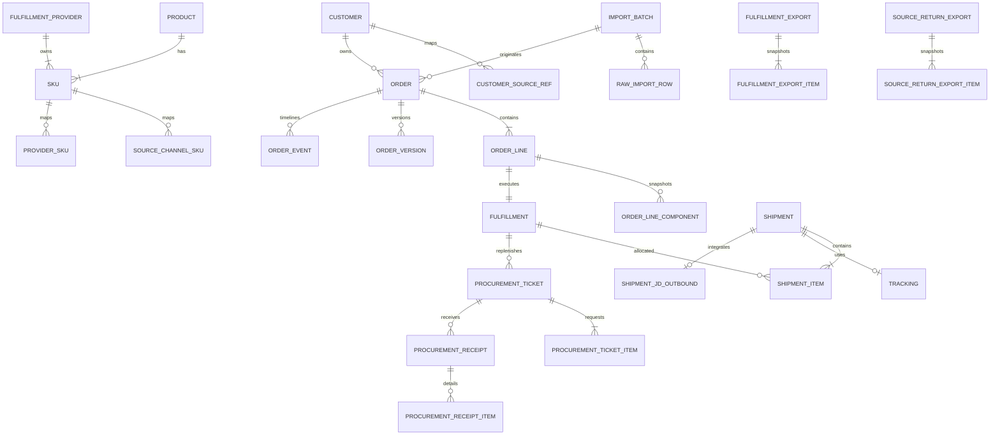

# PostgreSQL Schema V1

状态：已通过 Standards / Spec 双轴审查
依据：`docs/prd-v0.1.md`、`CONTEXT.md`、`wayfinder/tickets/db-schema-design.md` Q1–Q55、`wayfinder/tickets/product-bundle-and-pack-mapping.md`、`docs/api-contract.md`
空库权威快照：[`schema.sql`](schema.sql)。Flyway 使用已冻结的
[`V1__baseline.sql`](../backend/src/main/resources/db/migration/V1__baseline.sql)
和 `V2`–`V67` 增量迁移；两条路径必须得到等价的当前结构——
[`SchemaSnapshotMigrationEquivalenceTest`](../backend/src/test/java/cn/zimu/fulfillment/schema/SchemaSnapshotMigrationEquivalenceTest.java)
用 Testcontainers 分别以空库快照与 Flyway 全链建库，从 `pg_catalog` 比对表/视图/列
（类型/可空/默认/identity）/主键/唯一键/check 约束/外键/普通索引/触发器/显式序列/
函数/视图定义等结构事实，不等价即失败（更新责任见 §11）。

## 1. 设计结论

- PostgreSQL 使用 `app` 业务 schema 与 `analytics` 分析 schema。
- 当前权威快照共 71 张业务表、4 个分析视图和 2 个操作视图。
- 有限且仍可能演进的状态值使用 `VARCHAR + CHECK`；可扩展的 OrderEvent 类型使用目录表。
- 所有业务时间使用 `TIMESTAMPTZ`；Java 使用 `Instant`。来源 Excel 的无时区时间按 `Asia/Shanghai` 解释，分析视图也按上海自然日分桶。
- 所有数量使用 `NUMERIC(18,3)`；应用写入前必须拒绝超过三位小数的输入，不能依赖数据库隐式舍入。
- CanonicalOrder、原始 Excel 行、订单版本、业务事件、履约/回填文件版本长期保留。只追加表由数据库触发器禁止更新和删除。
- Schema 由 Flyway 管理；Spring/Hibernate 只能使用 `ddl-auto=validate`，不得在启动时创建或修改表。
- Demo 与业务数据共用领域代码但用 `data_scope` 强隔离；业务视图、文件、复核和提醒不接收 Demo 数据。

## 2. 核心关系

`Shipment` 不是订单行的子表。它表示一个出库/发货批次，可通过 `shipment_items` 包含同一 CanonicalOrder、同一 FulfillmentProvider、同一 Receiver 地址下的多个 Fulfillment。这样既支持普通多商品同箱，也支持 CustomBundle 同盒发货，同时保留一条 OrderLine 分多批发货的能力。

## 3. 表清单

### 3.1 客户、商品与履约方主数据（10）

| 表 | 职责 | 关键约束 |
|---|---|---|
| `customers` | 公司统一客户档案 | `customer_code` 唯一；BUSINESS/DEMO 分域 |
| `customer_source_refs` | 来源客户身份映射 | `(source_channel, source_customer_ref)` 唯一；不得按电话自动合并 |
| `categories` | 商品品类树 | code 唯一；禁止自指父级 |
| `products` | 商品族 | 可保存品牌；规格、单位和履约方不放在 Product |
| `fulfillment_providers` | 京东云仓或第三方履约方 | `provider_code` 生成后不可变；保存运单 SLA |
| `skus` | 公司唯一可履约 SKU | `SKU-{provider_code}-{6位全局流水号}`；provider 不可变；净含量、计量单位、包装件数和包装单位须成组填写，库存计数单位独立保存 |
| `sku_aliases` | 人工检索候选别名 | 只用于建议，不自动建立业务映射 |
| `source_channel_skus` | 来源平台商品到内部 SKU 的显式映射 | `(source_channel, source_sku_ref)` 唯一；`quantity_multiplier` 缺失时只能进入人工复核，正值时参与来源数量换算 |
| `provider_skus` | 内部 SKU 到履约方商品编码的映射 | provider 必须与 SKU 归属一致 |
| `provider_stock_snapshots` | 标准化库存观测快照 | 我方库存允许标准快照；外部京东云仓只允许分类为 `JD_PIECE/JD_ISC_QUERY_STOCK` 的只读观测；只追加，历史单位不明时保持 `UNKNOWN` |

普通第三方自有库存不进入 `provider_stock_snapshots`。京东云仓是受控例外：系统可追加实时只读观测用于出库门禁，但不预占或改写京东库存，也不会因此获得公司自营采购资格。系统维护第三方专属 SKU、生成发货指令并接收实发结果，但不采集、判断、预占或改写其他第三方库存。

### 3.2 Excel 接入与 CanonicalOrder（6）

| 表 | 职责 | 关键约束 |
|---|---|---|
| `import_batches` | SOURCE_ORDER 或 PROVIDER_TRACKING 文件批次 | 一个批次只能属于一个来源渠道或履约方；运单回传必须显式关联原 `fulfillment_export`；文件 hash 按该范围幂等；REVISION 与父批次同类型、同渠道/履约方/原导出、同模板族且版本号连续 |
| `raw_import_rows` | 原 Sheet/行号/单元格快照 | 原始坐标和 `raw_cells` 不可修改；状态可以推进 |
| `orders` | 长期 CanonicalOrder 头 | 三平台 BUSINESS 订单必须关联 SOURCE_ORDER 导入批次；WECOM 内部接口与隔离 Demo 不伪造文件血缘；Receiver 与结账信息快照；乐观锁 `lock_version` |
| `order_lines` | CanonicalOrder 商品行 | SINGLE/CUSTOM_BUNDLE；权威 `processing_stage` 在行级；普通行保存来源数量与映射乘数快照，约束其乘积等于 Canonical 请求量 |
| `order_line_components` | 当单礼包组件快照 | 同一礼包只允许一个 provider；组件总量必须等于礼包份数×单礼包用量 |
| `order_versions` | 每次已提交领域变化的完整 JSONB 快照 | `(order_id, version_no)` 唯一；只追加，不用于覆盖式回滚 |

`raw_import_rows.order_id/order_line_id` 保存原文件与业务事实的逐行血缘。问题行可进入 NEED_REVIEW，不阻塞同文件其他有效行。

订单来源主/子单号存在时直接使用；缺失时，Adapter 只能在同一 import batch、同一 Sheet 内把连续且 Receiver 姓名/电话/地址规范化后完全相同的行归为一个 CanonicalOrder。禁止跨 Sheet 或跨文件猜测合并。

### 3.3 履约、发货与采购（10）

| 表 | 职责 | 关键约束 |
|---|---|---|
| `fulfillments` | 一条 OrderLine 的履约单元 | OrderLine 1:1；provider 固定；累计实发和取消量守恒 |
| `shipments` | 一个出库/发货批次 | `outbound_order_no` 是系统生成的 12 位上海业务日流水且同 provider 唯一；同订单/provider 的 `shipment_sequence` 唯一且不可变；Receiver 快照不可变 |
| `shipment_items` | Shipment 与 Fulfillment 的数量分配 | 支持“一批多行”和“一行多批”；已实发量、取消量和所有 CREATED 批次的待出库量共同守恒；礼包只能按完整份数 |
| `shipment_jd_outbounds` | Shipment 级京东出库集成记录 | `shipment_id` / `erp_delivery_no` 唯一；独立持久同步状态、请求指纹、外部引用、失败/对账事实和当次 `client_mode`，旧记录为 `UNKNOWN` |
| `trackings` | Shipment 的物流公司与运单号 | P0 一个 Shipment 最多一个 Tracking；运单只追加，不覆盖冲突值 |
| `shipment_syncs` | Shipment 向来源渠道回传的权威状态与 durable intent 投影 | `(shipment_id, source_channel)` 唯一；SYNCING 必须保存 intent/platform intent、check/artifact hash、来源行、承运商、运单、开始时间与累计尝试次数；`lock_version` 做 CAS；PENDING 必须清空旧确认事实；与文件 fallback 共享 Shipment 行锁 |
| `procurement_tickets` | 我方库存缺口协同工单头 | 仅允许 `inventory_managed_by_us=true` 的履约方；第三方短发不能创建该工单 |
| `procurement_ticket_items` | 缺货 SKU/礼包组件明细 | 普通项必须是本行 SKU，礼包项必须是本行组件；fulfilled 只能由只追加回执累计 |
| `procurement_receipts` | 一次 SUCCESS/PARTIAL/FAILED 回执头 | 一张工单可接收多次回执；只追加 |
| `procurement_receipt_items` | 回执逐工单明细可用量 | 回执与工单项必须属于同一工单；只追加 |

`provider_stock_snapshots` 是当批 Fulfillment 判断依据，但不构成预占或锁单；每批必须重新读取我方库存快照。

默认合箱键是“同一 CanonicalOrder + 同一 FulfillmentProvider + 同一 Receiver 地址 + 同一发货批次”。这些商品行共享一个 `outbound_order_no` 和一个 Tracking。不同 provider 必须拆开；缺货后的后续批次创建新的 Shipment、出库单号和运单。同一出库单回传多个冲突运单时进入 `MULTIPLE_TRACKINGS_FOR_OUTBOUND` ReviewCase，P0 不猜测。

第三方回传短发或失败时，系统保存真实 Shipment/Tracking/剩余量并创建 `THIRD_PARTY_FULFILLMENT_EXCEPTION` 复核和提醒；它不触发我方采购，也不修改我方库存。

### 3.4 文件输出与回填（6）

| 表 | 职责 | 关键约束 |
|---|---|---|
| `fulfillment_exports` | 一份只属于一个履约方的发货指令文件 | 京东/第三方模板分开；文件版本只追加；快照运单 SLA 截止时间 |
| `fulfillment_export_items` | 导出逐行不可变快照 | Fulfillment/OrderLine/Shipment/provider 必须同源；普通 SKU 一行，礼包完整展开全部组件且数量等于本批礼包数×单份用量 |
| `source_return_exports` | 按来源原格式生成的版本化回填文件与人工 fallback push 投影 | `(import_batch_id, version_no)` 唯一；生成事实永久不可改；已失效 artifact 禁止 PUSHING；push 仅允许 NOT_PUSHED/FAILED→PUSHING→SUCCESS/FAILED；进入 PUSHING 时按不可变 items 排序锁住关联 Shipment，并拒绝 SYNCING/SYNCED/RECONCILIATION_REQUIRED 的在线回传 |
| `source_return_export_items` | 原始行到 Shipment/运单的回填快照 | 首个关联 Shipment 正常回填；预计或已经存在后续 Shipment 时创建 `MULTI_SHIPMENT_SOURCE_FOLLOWUP` ReviewCase，禁止复制来源行、拼接或覆盖运单；零实发全量取消用 CANCELLED 且不伪造 Shipment |
| `fulfillment_export_wecom_states` | 每第三方导出一行的企微出站/提醒状态（#84） | `export_id` 唯一；status ∈ PENDING/ACTIVE/COMPLETED/MANUALLY_STOPPED/FAILED/UNKNOWN/LEGACY；ACTIVE 必须携带 `initial_sent_at`/`tracking_due_at`/`chat_id`（ack 派生计时起点 + 快照群）；COMPLETED/人工停止清 `next_reminder_at`；LEGACY = 迁移历史导出，`initial_sent_at` 必空、绝不自动入队；SLA 与提醒间隔生成时快照；`lock_version` 乐观并发 |
| `fulfillment_export_wecom_deliveries` | 每次 initial/reminder 尝试的证据（#84） | `UNIQUE (export_id, kind, sequence)` 防同一 initial/同一 reminder sequence 重复入队与并发发送；status ∈ PENDING/SENDING/SENT/FAILED/UNKNOWN；SENT ⟺ 携带服务端 ack 接收时刻（计时起点证据）；`attempts <= max_attempts`（默认 2 = 1 次自动重试）；只存 `media_id_sha256` 摘要，不落 media_id 明文或文件内容 |

多 Shipment 的后续发货事实不会丢失：管理后台沿 OrderLine → Fulfillment → ShipmentItem → Shipment → Tracking 展示完整批次序号、实发数量、履约方、出库单号、快递公司、运单号和时间。自动来源回填只处理该 OrderLine/Fulfillment 关联的最早 Shipment，后续由人工跟进；不能把订单+履约方范围的全局 `shipment_sequence=1` 当作每行首批。采购仍进行时保留 `PROCUREMENT_IN_PROGRESS`，由开放 ReviewCase 表达人工责任；全部真实 Shipment 已有 Tracking 且履约达到终局后，OrderLine 才转 NEED_REVIEW 等人工确认。人工在来源平台完成后续处理后，通过后台“已完成后续回传”填写备注，系统在同一事务记录处理人/时间、关闭 ReviewCase、推进 OrderLine 并写事件/版本/审计，不要求再上传文件。

京东导出行的 `item_amount` 必须是数值 `0`。它只是京东接口必填参数，不是 CanonicalOrder 的订单金额。COD 输入没有可信应收金额时必须进入 `COD_AMOUNT_REQUIRED` ReviewCase，禁止用该 `0` 冒充货到付款金额。

### 3.5 运营、审计与接入（8）

| 表 | 职责 | 关键约束 |
|---|---|---|
| `review_cases` | 阻断自动流程的人工复核 | 同主体+原因只能有一条 OPEN case；禁止关联 Demo 订单 |
| `operational_alerts` | 不阻断但要求知晓的黄/红提醒 | 活跃同类提醒幂等；禁止关联 Demo 订单 |
| `connector_configs` | 四个来源渠道的 Client 与传输模式、快递公司显式映射和最近拉取状态 | `mode=MOCK/REAL` 与 `transport_mode=EXCEL/API` 分轴；`config.carrier_mappings` 首批维护京东物流到彩食鲜 `JD`、聚福宝/飞象 `京东物流` 的映射；缺映射进入人工复核 |
| `channel_messages` | 企业微信原始文字证据 | `(企微主体, 连接, 消息 ID)` 唯一；只保存通道证据与受控原始载荷，不解释意图、不创建订单或运单 |
| `audit_logs` | 接口、Agent 和人工操作审计 | BUSINESS/DEMO 分域；只追加 |
| `demo_runs` | 隔离 Mock DemoScenario 运行 | 只能引用 DEMO order；不进入业务文件、复核、提醒或 analytics |
| `idempotency_registry` | 写操作抢占、租约、结果重放与崩溃恢复 | `(scope, idempotency_key)` 主键；scope 是服务端稳定用例码而非封闭枚举；同 key 不同 hash 由应用返回 409 |
| `outbound_number_counters` | 系统出库单号的上海业务日流水 | 每日原子递增 1–9999；由 `next_outbound_order_no()` 生成 `yyyyMMdd` + 四位流水，禁止 `MAX + 1` |

### 3.6 事件时间线（2）

| 表 | 职责 | 关键约束 |
|---|---|---|
| `order_event_types` | 可扩展的语义事件目录 | code 主键；不使用 PostgreSQL native enum |
| `order_events` | Order Timeline | `(order_id, sequence_no)` 唯一；可关联行、Fulfillment、Shipment、采购工单；只追加 |

Timeline 按订单内 `sequence_no`/`created_at` 排序，不按事件类型字典序或定义顺序排序。

### 3.7 渠道消息、草稿复核与后台任务（14）

| 表 | 职责 | 关键约束 |
|---|---|---|
| `channel_identities` | 渠道侧客户/群身份标识 | `corp_id`/`channel_identity`/`access_type` 非空 |
| `message_submissions` | 一条渠道消息的解析提交入口 | `submission_no` 唯一；`status ∈ RECEIVED/INTERPRETED/FAILED/DRAFTED/CONFIRMED/REJECTED`；`source_message_id → channel_messages` ON DELETE RESTRICT |
| `message_interpretations` | 提交的 AI 解释结果（版本化） | `version >= 1`；`intent ∈ CUSTOMER_ORDER/SUPPLIER_TRACKING/ORDER_CHANGE/ORDER_CANCEL/NON_BUSINESS/NEED_REVIEW`；`structured_output` 必须为 object；`provider/model/prompt_version` 非空 |
| `message_media` | 消息媒体证据（图片/文件/语音/视频） | 必须关联 `submission_id` 或 `channel_message_id` 至少其一（`num_nonnulls > 0`）；`media_type ∈ image/file/voice/video`；`download_status ∈ PENDING/DOWNLOADING/AVAILABLE/FAILED`；`attempts >= 0` |
| `wecom_events` | 企微平台事件回调与卡片点击/更新证据 | `(event_type, msgid)` 唯一；首次 bot/chat/actor/event/task/草稿/raw facts 不可变；`processing_claim_token + processing_attempt` 栅栏业务尝试；`update_status` 与 `fallback_status` 分别记录 5 秒快路径和文字补偿 |
| `order_drafts` | 客户订单草稿（复核对象） | `draft_no` 唯一；OPEN ⟺ `confirmed_by`/`confirmed_at` 均为空，CONFIRMED/REJECTED ⟺ 两者均非空；`revision >= 0`；`customer_candidates`/`missing_fields` 为 array；`settlement_time` 是确认必需事实 |
| `order_draft_lines` | 订单草稿明细行 | `(order_draft_id, line_no)` 唯一；`line_no >= 1`；`quantity > 0`；`fulfilled_quantity >= 0`；`sku_candidates` 为 array |
| `wecom_order_draft_cards` | 订单草稿确认卡片发送栅栏 | `order_draft_id`/`task_id` 各自唯一；`route_type + chat_id` 固化原 single/group 路由语义；外部提交中的 `SENDING` 崩溃恢复为 `UNKNOWN`，禁止盲目重发；草稿已关闭或 revision 已变化时在触网前进入 `SUPERSEDED`；`SENT` 必须有 `request_id`/`acknowledged_at` |
| `provider_tracking_drafts` | 运单草稿（含批量确认） | `draft_no` 唯一；status 约束同 `order_drafts`；`shipment_judgment ∈ FULL/PARTIAL/SHORTAGE/EXCEPTION`；`carrier_candidates`/`task_candidates`/`validation_issues` 为 array |
| `async_tasks` | Worker 后台任务队列 | `idempotency_key` 唯一（幂等收敛）；`task_type`/`payload_ref` 非空；`attempts >= 0`、`max_attempts >= 1`；status ∈ PENDING/RUNNING/FINALIZING/SUCCEEDED/FAILED |
| `agent_runs` | Agent 运行记录 | `run_id` 形如 `run_[0-9a-f]{32}`；RUNNING ⟺ `finished_at IS NULL`；FAILED ⟺ `error_type IS NOT NULL`；`input_digest` 为 64 位 hex |
| `agent_tool_calls` | Agent 工具调用轨迹 | `sequence_no > 0`；status ∈ SUCCESS/FAILED |
| `carrier_prefix_mapping_sets` | 运单前缀映射单例集 | `singleton_id = 1` 唯一单例；`lock_version` 乐观锁；`updated_by` 非空 |
| `carrier_prefix_mappings` | 运单号前缀 → 承运商代码映射 | `prefix` 匹配 `^[A-Z]{1,16}$`；`carrier_code` 匹配 `^[A-Z][A-Z0-9_]{0,63}$` |

消息链路血缘为 `channel_messages`（§3.5 原始证据）→ `message_submissions` → `message_interpretations`（同一提交多版本）→ 草稿（`order_drafts`/`provider_tracking_drafts`）。`message_media` 只保存证据，不参与解释；`async_tasks` 由 `InterpretationWorker` 以 `SKIP LOCKED` 租约轮询领取，`ApplicationFence.SUPERSEDED` 让被取代版本的任务成为幂等 no-op。

V53 在既有 `agent_definitions` 中播种 `source-sync-reviewer` v1：仅白名单只读工具 `check_shipment_source_sync`，`allow_write=false`、`guard_exemptions=[]`，输出只能作为人工确认前的建议，不能执行回传或对账。

### 3.8 内部运营人员与企微业务通知（5）

| 表 | 职责 | 关键约束 |
|---|---|---|
| `internal_operators` | 内部运营人员登记：姓名、企微 userid、所属责任团队（Issue #89） | `wecom_userid` 可空（未绑定），非空时全局唯一（partial unique index，同一企微 userid 只映射一个人）；`responsible_team` 非空且大写（ORDER_OPS/CUSTOMER_OPS/SKU_OPS 等）；不做物理删除，停用（active=false）后解析 seam 不再返回；只做映射与责任归属，不做登录/角色/权限 |
| `wecom_notification_items` | 复核/订单创建/发货完成的隐私最小化 outbox 事实（Issue #90） | `(source_type, source_id, notification_kind)` 唯一；固定 5 分钟窗口；summary 只含业务标识，不复制事件 payload/收件人 PII；DEMO 订单不捕获 |
| `wecom_notification_batches` | 同责任团队、同窗口的持久化汇总与 Worker 租约 | PENDING/RUNNING 可恢复；终态 SENT/PARTIAL/BLOCKED/UNKNOWN/FAILED；RUNNING 必须携带 lease_owner/lease_until |
| `wecom_notification_deliveries` | 批次到每个运营收件人的发送 fence 与可追溯原因 | `(batch_id, recipient_key)` 唯一；仅明确未提交的失败可 RETRY_PENDING；SENDING 重启/ack 不明收敛 UNKNOWN，禁止盲重发；未绑定/无人负责显式 BLOCKED |
| `wecom_notification_alerts` | BLOCKED/FAILED/UNKNOWN 的持久运营告警投影 | `(delivery_id, item_id)` 与 `alert_key` 双重稳定去重；可关联订单/订单行/履约/发货时保存外键，只有草稿/导入/消息主体时仍保留投影；YELLOW=BLOCKED，RED=FAILED/UNKNOWN，重启恢复不重复建告警 |

### 3.9 中汇 PMS 外部写意图（2）

| 表 | 职责 | 关键约束 |
|---|---|---|
| `zhonghui_pms_upload_batches` | 中汇商品批量上传的稳定外部写意图与批次汇总 | `idempotency_key` 非空且唯一，同 key 恢复只能复用原批次；状态 PENDING→COMPLETED |
| `zhonghui_pms_upload_batch_items` | 批次内逐 SKU 的外部写事实 | `(batch_id, sku_id)` 唯一；V50 若发现历史重复会保留全部证据并显式阻断迁移，须人工对账后重跑；状态 PENDING/SUCCESS/FAILED；恢复时 SUCCESS/FAILED 不重写，PENDING 只查询对账，查不到进入 RECONCILIATION_REQUIRED |

## 4. 状态维度

| 维度 | 存储位置 | 当前值 |
|---|---|---|
| OrderStatus | `orders.order_status` | RECEIVED、VALIDATED、SKU_MAPPED、FULFILLING、SHIPPED、SYNCED、CLOSED、NEED_REVIEW、OUT_OF_STOCK、PROCUREMENT_PENDING、FULFILLMENT_EXCEPTION、SYNC_FAILED、CANCELLED |
| ProcessingStage | `order_lines.processing_stage` | NEED_REVIEW、READY_TO_EXPORT、WAITING_PROVIDER、PROCUREMENT_IN_PROGRESS、TRACKING_RECEIVED、RETURN_FILE_READY、COMPLETED、EXCEPTION |
| ShippingProgress | `fulfillments.shipping_progress` | NOT_SHIPPED、PARTIALLY_SHIPPED、SHIPPED |
| FulfillmentOutcome | `fulfillments.outcome` | IN_PROGRESS、FULLY_FULFILLED、PARTIALLY_FULFILLED、CANCELLED |
| ShipmentStatus | `shipments.shipment_status` | P0：CREATED、SHIPPED、FAILED；未来物流回调：DELIVERED |
| SyncStatus | `shipment_syncs.sync_status` | PENDING、SYNCING、SYNCED、SYNC_FAILED、RECONCILIATION_REQUIRED |
| ProcurementStatus | `procurement_tickets.procurement_status` | PENDING、SUCCESS、PARTIAL、FAILED、CANCELLED |

OrderProgressSummary 不写回 `orders`。`app.v_order_progress_summary` 从订单行和活跃提醒派生：

- BLUE：内部自动处理中；
- YELLOW：等待履约方/人工动作，包括 WAITING_PROVIDER、NEED_REVIEW、PROCUREMENT_IN_PROGRESS；
- RED：显式异常或红色提醒；
- GREEN：全部 OrderLine 完成。

摘要同时返回 `completed_count/total_count`。EXCEPTION 覆盖普通进度；否则按最慢未完成阶段显示。

## 5. 关键事务边界

以下每项必须在一个数据库事务内完成，失败时整项回滚：

1. 来源行解析 → CanonicalOrder/OrderLine → ReviewCase（若有）→ OrderEvent → OrderVersion → AuditLog。
2. 履约导出 → Shipment/ShipmentItems(CREATED) → FulfillmentExport/Items → 行冻结 → OrderEvent → OrderVersion → AuditLog。
3. ProviderTrackingBatch 必须显式关联原 FulfillmentExport，先整批校验，再共同写 Shipment 实发结果、Tracking、ProcessingStage、提醒/复核、事件、版本和审计。
4. 采购回执头/明细 → 工单累计量 → 可发完整礼包份数 → 后续履约或异常 → 事件、版本和审计。
5. SourceReturnExport 头/逐行快照/文件引用 → ProcessingStage → ShipmentSync → 事件、版本和审计。

ProviderTrackingBatch 的“原子”指结构与关联全有或全无，不表示所有业务结果必须成功。同一合法文件可以同时包含 SHIPPED、PARTIAL 和 FAILED 行。

## 6. 不变量与数据库防线

DDL 的 CHECK、UNIQUE、FK 和触发器覆盖以下高风险规则：

- provider code、SKU 编号、SKU provider 在创建后不可改变；SKU 编号必须与 provider code 和全局流水号一致。
- Orders、Fulfillments 及所有有 PATCH/人工命令的可变主数据、配置、提醒和采购工单使用 `lock_version`（ReviewCase 使用 `resolution_version`）承接 API `expected_version`；应用必须条件更新并递增。
- provider SKU 映射、库存快照、OrderLine/Fulfillment、礼包组件必须使用同一 provider。
- 第三方 provider 不能写入库存快照。
- CustomBundle 份数必须是整数；组件总量必须等于礼包份数×单份用量。
- OrderLine 首次进入 FulfillmentExport 后，SKU、provider、数量、规格、单位和礼包组件不可原地修改；订单 Receiver 和结账字段也冻结。
- Shipment 的订单、provider、出库单号、批次序号和 Receiver 快照不可修改；状态只允许 CREATED→SHIPPED/FAILED，或未来 SHIPPED→DELIVERED。`SHIPPED` 可以在履约方未提供可靠时间时保留 `shipped_at=NULL`；非已发货状态不得填写实际发货时间。
- `outbound_order_no` 由数据库每日原子分配器按上海业务日生成；同日超过 9999 笔直接失败，不扫描 Shipment 做 `MAX + 1`。
- ShipmentItem 的指令分配不可改；首次接收的实发数量不可覆盖。触发器锁定 Fulfillment，以已实发、已取消和既有 CREATED 批次待出库量共同计算余量，阻止并发重复生成满量批次；礼包指令/实发只能是完整份数。
- Tracking 唯一且只追加；冲突值不能覆盖旧值。
- 采购回执及明细、订单版本、OrderEvent、AuditLog、履约导出和来源回填版本只追加。
- 履约导出逐行校验 Shipment/Fulfillment/OrderLine/provider/SKU/数量血缘，并以延迟约束验证整组普通行或礼包组件完整。
- 来源回填逐行校验原批次、原始行、订单行、Shipment、Tracking 与实发快照血缘；延迟约束在事务结束前验证每个已接受原始行均被表示，且最终版没有等待或异常行。
- `orders.data_scope` 与来源身份不可变；ReviewCase/OperationalAlert 的所有业务主体必须属于同一 BUSINESS order；DemoRun 只能指向 Demo order；业务视图统一过滤 Demo。

仍由应用事务负责的聚合语义包括“SUCCESS/PARTIAL 采购回执至少有一条明细”“OrderVersion JSONB 快照包含订单头、行、子状态和关联 id”“文件字节、数据库快照与 hash 同步提交”。数据库触发器负责可由关系数据可靠判断的跨表血缘与数量防御。

## 7. 文件幂等与版本

- 完全相同文件：`batch_type + content_sha256 + source/provider scope` 唯一，返回已有批次。
- 修订文件：必须显式 `import_mode=REVISION`、指定父批次并增加 revision；原批次不覆盖。
- 来源回填：`(import_batch_id, version_no)` 唯一；阶段版和最终版都不可修改。
- 履约导出：一份文件只含一个 provider；京东和每个第三方独立生成。
- 写接口：先抢占 `idempotency_registry`。外部副作用开始后失联进入 RECONCILIATION_REQUIRED，禁止盲重试。

## 8. 分析与操作视图

| 视图 | 粒度 | 主要指标 |
|---|---|---|
| `app.v_order_progress_summary` | Order | 最差 ProcessingStage、四色健康度、完成数/总数、关注原因 |
| `analytics.v_channel_daily` | 上海自然日×SourceChannel | 订单数、行数、实际发货数量、Shipment 数、异常、缺货、回传失败；实发量按渠道乘数换算后的 Canonical SKU 件数，礼包展开组件；未提供实际发货时间的 Shipment 不归入任何“实际发货日” |
| `analytics.v_product_daily` | 上海自然日×SourceChannel×Product×SKU | 订单数、Shipment 数、实际发货数量；与渠道视图同口径，礼包按组件数量展开；未提供实际发货时间的 Shipment 不归入任何“实际发货日” |
| `analytics.v_fulfillment_daily` | 上海自然日×FulfillmentProvider | 履约量、未/部分/全部发货、采购、待出库、待运单、待回传、回传失败 |
| `analytics.v_fulfillment_channel_daily` | 上海自然日×FulfillmentProvider×SourceChannel | 按履约方与来源渠道交叉分组的履约、Shipment 和回传指标 |

所有视图只读取 `orders.data_scope='BUSINESS'`。Metabase 和 React/ECharts 必须复用这些口径，不另写一套指标 SQL。

## 9. P0 完成语义

当前未接入京东 SDK 物流回调。P0 的 `ProcessingStage=COMPLETED` 仅表示：

1. 每个有效实际发货批次都已取得快递公司与运单号；
2. 剩余量已经履约或有明确人工终局；
3. 已生成最终来源回填 Excel。

P0 不等待客户签收或妥投，Shipment 可以停留在 SHIPPED，且履约方未提供实际发货时间时保持 `shipped_at=NULL`，不得用回传、接收或审计时间填充。DELIVERED 只在未来真实物流轨迹接入后使用，当前不得伪造。

## 10. 验证方式

DDL 必须通过以下门槛：

1. PostgreSQL 16 空库先执行 `docs/schema.sql`；应用启动时由 Flyway 按版本顺序执行全部增量 migration。
2. `information_schema` 实测 71 张 `app` 基础表、2 个 `app` 操作视图和 4 个 `analytics` 分析视图。
3. 执行 `docs/schema-smoke.sql`，覆盖：上海业务日出库单号原子流水、运单回传与原 FulfillmentExport/provider 关联、已发货但未提供实际发货时间、非已发货状态的不一致时间拒绝、第三方库存写入拒绝、错误修订链拒绝、跨 provider/非整份礼包拒绝、重复待出库批次拒绝、跨订单导出/回填拒绝、Demo 业务隔离、京东金额非 0 拒绝、Shipment 超发拒绝、Tracking 冲突拒绝、最终回填含等待项拒绝、已导出订单字段冻结、分析视图排除 Demo 和未知实际发货日数据，以及渠道/商品实发量的乘数换算与礼包组件展开。
4. `git diff --check` 无空白错误。
5. `SchemaSnapshotMigrationEquivalenceTest`（Testcontainers，`mvn test` 默认阶段运行）：分别用
   `docs/schema.sql` 与 Flyway 全链（V1..V67）建库，比对 12 类结构事实（见 §1 引言），不等价即失败。

## 11. 快照与迁移链的更新责任

`schema.sql`（空库权威快照）与 Flyway 迁移链是同一结构的两种建库路径，必须保持等价：

- **任何 schema 变更**（表、列、约束、索引、触发器、函数、视图）必须**同时**落在两处：
  1. 新增一条 Flyway 增量迁移（`V{n}__*.sql`）——运营与测试环境的唯一真实路径；
  2. 同步更新 `docs/schema.sql`——开发与文档的对照基线。
  两者缺一都会让 `SchemaSnapshotMigrationEquivalenceTest` 变红；该测试就是「两条路径等价」
  这句话的背书，**不要通过放宽断言让它变绿**。
- **只改数据的迁移**（INSERT/UPDATE 播种、清洗）不需要进快照：快照承诺的是结构等价，不含数据；
  播种数据以迁移链为准。
- `docs/schema-export-current.sql` 是 2026-08-17 从活库 `pg_dump` 的一次性交接基线，早于
  V33（缺 `agent_definitions`/`agent_eval_cases`），**不是**本仓库维护的当前结构快照，与迁移链
  没有联动机制；需要交接基线时按 `docs/schema-export-current.md` 的说明重新导出，不要拿它替代
  `schema.sql`。

Spring Data Entity 与 Flyway 已在后续构建票落地；Excel Adapter 仍由对应闭环票实现。
